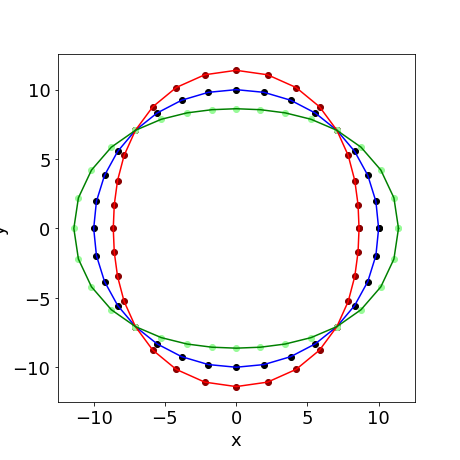
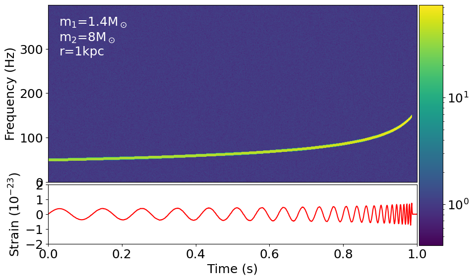

# GW Compact Binary

Documentation and code repository for the PH 821 course project. The final submission can be viewed [here](gwsignal.ipynb). The results are presented in the form of a python notebook which has `numpy`, `matplotlib` and `yaml` as its only dependencies. 

The code simulates gravitational waves produced during the inspiral phase of compact binaries in circular orbits under linearised gravity. Each of these components can be independently extended. 

A static image of the ring of test particles is shown below

An example of the dynamic spectrum that can be obtained using the code is shown below

This work has been licensed under the MIT License. For more information, read [this](LICENSE)
